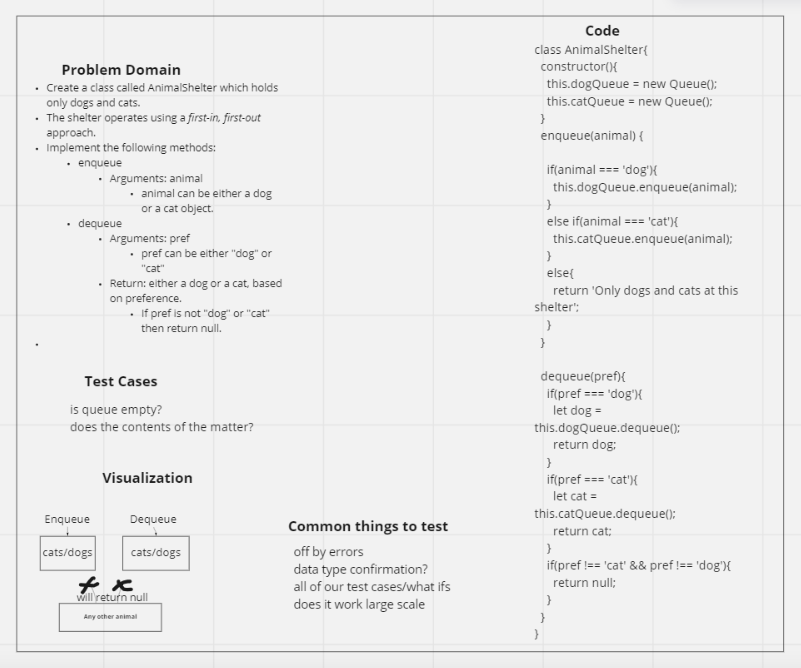

# First-in, First out Animal Shelter.

## Challenge

- Extending an Implementation

- Implement a Stack Queue Animal Shelter

## Approach & Efficiency

- O(1)

## Collaborators

- Worked with Luis Rosales

## Whiteboard

